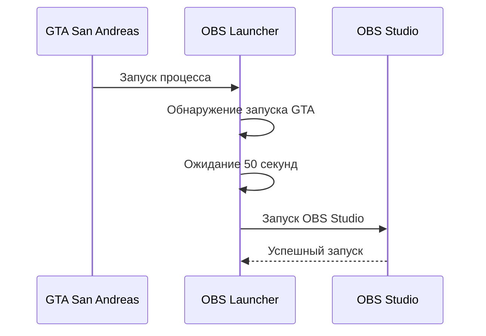

# 🚀 OBS Launcher: Автоматический запуск OBS Studio для GTA San Andreas

[](https://github.com/kromskii2/OBSLauncher/releases)
[](LICENSE)
[](https://dotnet.microsoft.com)

Ваш незаменимый помощник для стриминга и записи геймплея GTA San Andreas! OBS Launcher автоматически запускает OBS Studio через 50 секунд после старта игры. Просто, удобно, эффективно!

 <!-- Замените на реальный скриншот -->

## ✨ Особенности

- ⏱️ **Автоматический запуск OBS Studio** после запуска GTA San Andreas (или любого другого процесса)
- ⏳ **Интеллектуальная задержка** 50 секунд перед запуском OBS (можно изменить)
- 🛡️ **Работа с правами администратора** для обнаружения процесса и автозапуска
- 📌 **Автозагрузка при старте Windows**
- 🎮 **Невидимый в игровом режиме** (работает в системном трее)
- 🔧 **Простая настройка** в главном окне
- 💻 **Лёгкий и быстрый** (менее 200 КБ на диске)

## 🚀 Установка

1. Скачайте последнюю версию из [раздела релизов](https://github.com/kromskii2/OBSLauncher/releases)
2. Распакуйте архив в любую папку
3. Запустите `OBSLauncher.exe` **от имени администратора** ⚠️

```bash
# Для разработчиков (требуется .NET 6.0 SDK):
git clone https://github.com/kromskii2/OBSLauncher.git
cd OBSLauncher
dotnet build
```

## 🖥️ Использование

1. После первого запуска программа добавится в автозагрузку
2. Иконка  появится в системном трее
3. Запустите GTA San Andreas как обычно
4. Через `50` секунд (***или установленный вами промежуток времени***) автоматически запустится **OBS Studio**!

### Управление через системный трей
| Действие              | Результат                     |
|-----------------------|-------------------------------|
| **Двойной клик**      | Показать окно приложения      |
| **Правый клик → Показать** | Открыть главное окно       |
| **Правый клик → Закрыть** | Полностью выйти из программы |

## ⚙️ Технические детали

### Как это работает


### Требования
- Windows 10/11 (x64)
- [.NET 6.0 Desktop Runtime](https://dotnet.microsoft.com/download/dotnet/6.0)
- OBS Studio (установленный в стандартную директорию)
- GTA San Andreas

## 🤝 Участие в разработке

Мы приветствуем вклад в проект! Вот как вы можете помочь:

1. 🐞 Сообщайте об ошибках через [Issues](https://github.com/kromskii2/OBSLauncher/issues)
2. 💡 Предлагайте новые функции
3. 🛠️ Делайте Pull Request'ы
4. ⭐ Ставьте звезду репозиторию

### Сборка из исходников
```bash
# Клонировать репозиторий
git clone https://github.com/kromskii2/OBSLauncher.git

# Восстановить зависимости
dotnet restore

# Сборка Release версии
dotnet build -c Release
```

## ❓ Частые вопросы

**Q: Почему именно 50 секунд?**  
A: Это время позволяет игре полностью загрузиться, особенно при использовании модов.

**Q: Как изменить путь к OBS?**  
A: Откройте окно, нажмите на кнопку **"изменить путь к OBS"**

**Q: Как полностью удалить программу?**  
A: 1. Закройте программу через трей. 2. Удалите файлы. 3. Удалите ключ реестра:  
`HKEY_CURRENT_USER\SOFTWARE\Microsoft\Windows\CurrentVersion\Run\OBSLauncher`

**Q: Можно ли изменить задержку?**  
A: Да, отредактируйте поле `с задержкой (сек):` в главном окне.

**Q: Можно ли использовать с другими играми или программами?**  
A: Да, измените имя процесса в поле `Когда активен процесс:` на нужное.

**Q: Почему программа требует права администратора?**  
A: Для надежного обнаружения запуска игры и управления автозагрузкой.

**Q: Можно ли временно отключить автозапуск OBS?**  
A: Да, нажмите на кнопку `Мониторинг активен` в окне программы.

**Q: Поле ввода (процесса/задержки) стало красным, что делать?**  
A: Поле ввода меняет цвет на красный, если введены некорректные данные. 
Убедитесь, что имя процесса указано правильно (например, `gta_sa.exe`), 
а задержка - положительное число.

## 📜 Лицензия

Проект лицензирован под [Apache License 2.0](LICENSE).  
© 2023 kromskii2. Все права защищены.

> **С любовью к геймерам и стримерам** ❤️  
> Если программа вам помогла - поставьте звезду на GitHub! ⭐
